# express-hls-streaming
## 1. What is it?
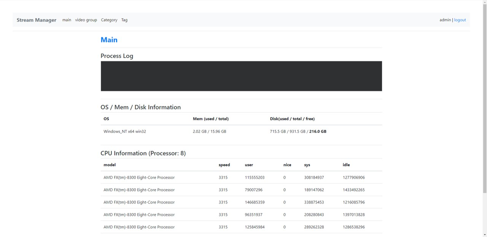</img>
This project is a server side HLS streaming management tool using expressjs, a nodejs based framework. 
Convert mp4 video to hls format using ffmpeg library.  

[Caution!] 
This project is inappropriate for practical use. 
It contains only very basic functions to convert mp4 files to hls standard, and the generated m3u8 also has only a single band. 

In order to fully use this project, in-depth improvement of ffmpeg, development of a separate front-end project, and route for api must be developed separately. 
The minimum data required for api development is included in the DB. 

Please take this project as a basic design for converting and managing the original video in hls format on the web rather than for actual use.  
* * *
## 2. Basic concept for hls

hls stands for Http Live Streaming, a streaming protocol developed by Apple. 
It consists of a .ts file that splits the original video into small pieces and an m3u8 file that contains meta information. 
When loading m3u8 files in the stream playback player, only the parts (.ts) needed for playback are loaded instead of loading the entire file at once. 
For more information, please refer to [this](https://d2.naver.com/helloworld/7122).  
This is the hls streaming flow chart of the project. 
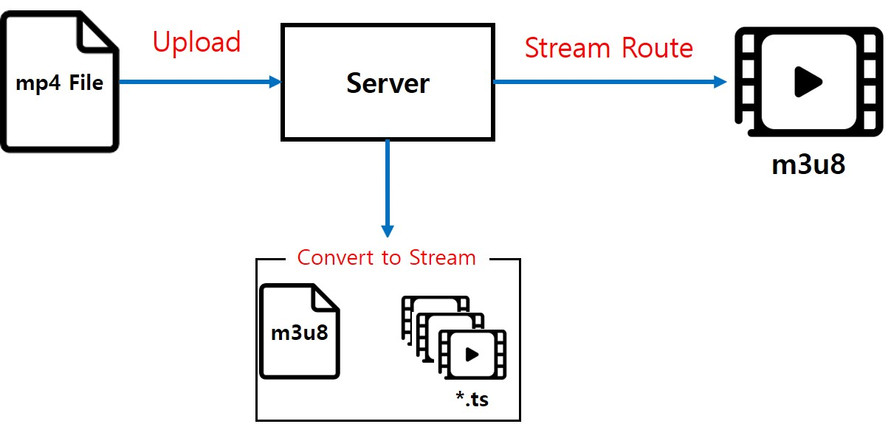</img>

## 3. Git Repository Download
<pre><code>
git clone https://github.com/leekanghyo/express-hls-streaming.git
</pre></code>
* * *
## 4. Install required packages
[Version Info]
- nodejs: v12.16.1
- npm: v6.14.4
- express-generator: v4.16.1
- sequelize-cli: v5.5.1
- mysql: v8.0.19
 

* * *

This project is based on nodejs, and the DB uses MySql. 
If you have not installed nodejs and MySql, please install it first. 
In this project, sequelize ORM is used to connect nodejs and MySql. 
Install sequelize-cli to use sequelize commands. 
<pre><code>
npm install
npm install --save-dev -g sequelize-cli
</pre></code>
 
Now you need to migrate your database. Before that, change the Mysql access information to suit your development environment. 
Database access information is managed in config/config.json. 
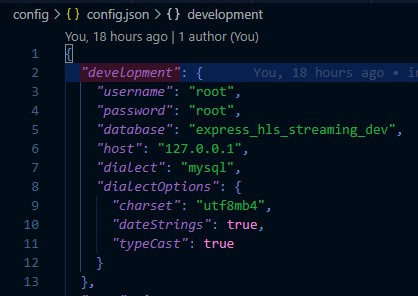 
If you have corrected the connection information, you should proceed with database migration. 
<pre><code>
sequelize db:migrate
sequelize db:seed:all
</pre></code>
You are now ready to use your project. 
Start the server with the following command. 
<pre><code>
npm start
</pre></code>
Access information. 

|addr|ID|PW|
|------|---|---|
|http://localhost:3000|admin|admin|

* * *
## 4. Project manual
</img>
This is the main page. 
On this page, you can check ffmpeg processing status, disk, memory, and CPU information. 
* * *
In order to upload a video, you need to follow three steps. 
- Step 1, Create category
- Step 2, Create Tag
- Step 3, Create video group
 

* * *
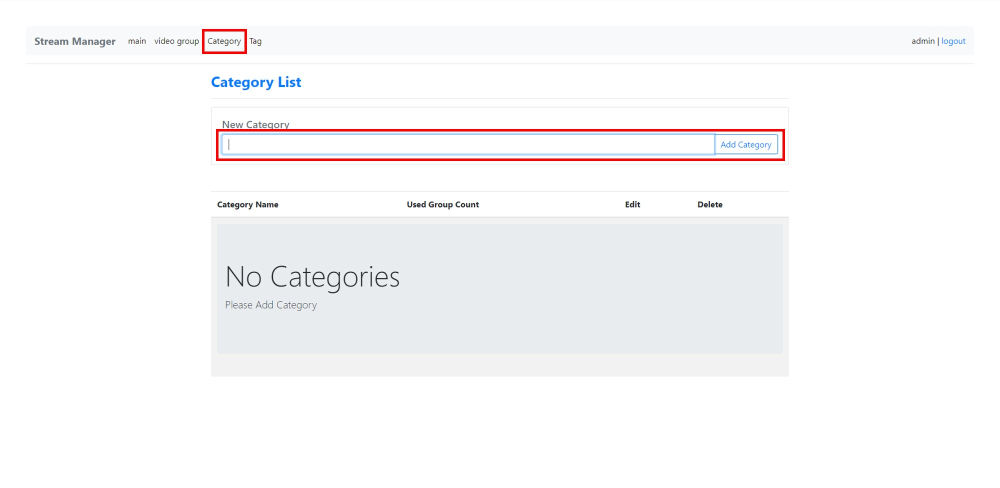</img> 

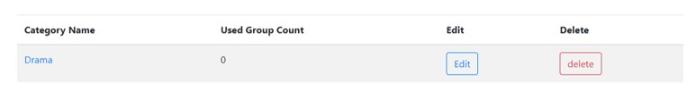</img>
 
First, create a category. When created, the list is updated. 
[Used Group Count] increases when you create a video group and use the corresponding category.  

* * *
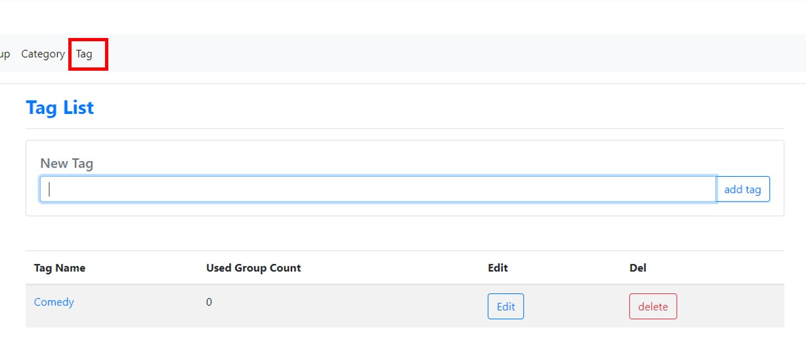</img> 
Add tags.  

* * *
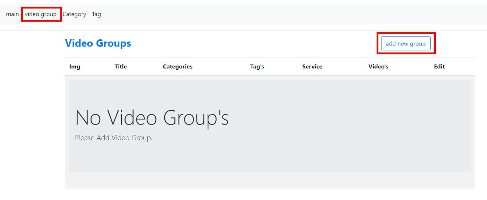</img> 
You can now create video groups. 
Click the Video Group and add new group buttons in order to move to the group creation page.  

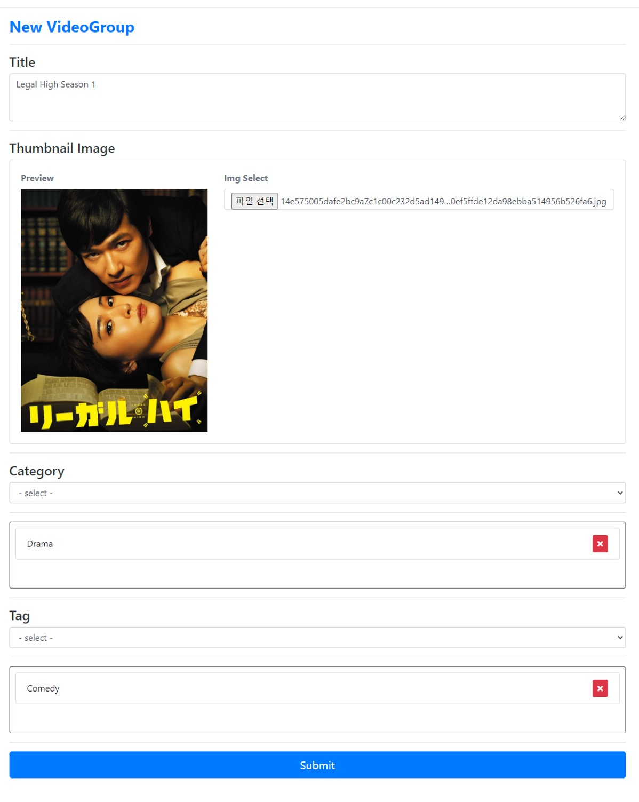</img>  
A video group consists of group title, thumbnail, category, and tag items. 
Enter each item with an appropriate value.  
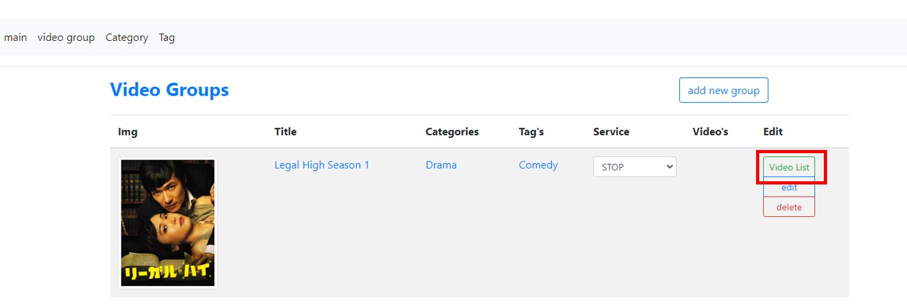</img>  
When the creation is successful, the list is updated. 
Click the Video List button to go to the list page. 

* * *
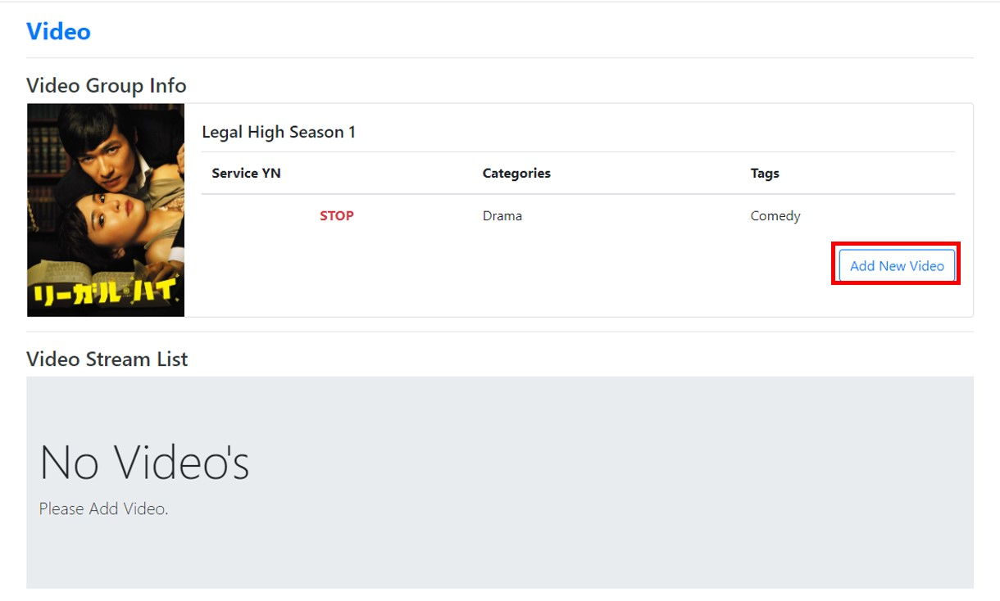</img> 
Click the Add New Video button to add a new video.  

* * *
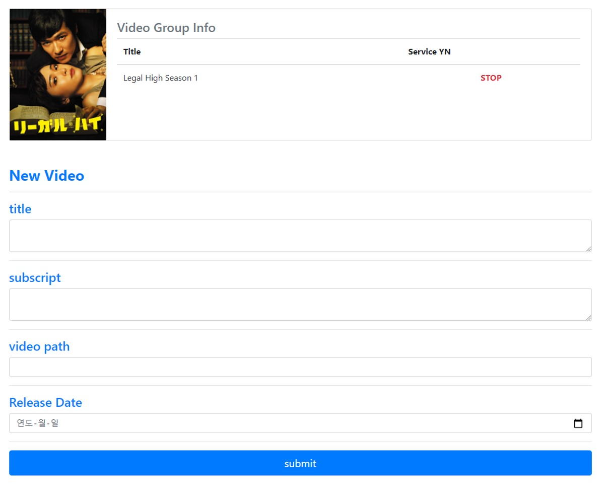</img> 
Video requires title, subscript, path of original video, and date information. 
The video path item is an input field. Enter the directory where the original video exists as an absolute path.  

* * *
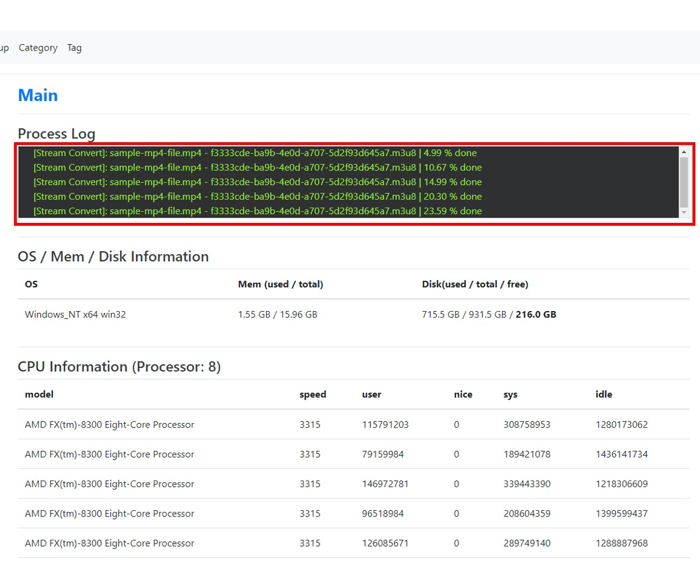</img>  
When video is added, it moves to the main screen, and the conversion progress status is shown in real time in the process log.  
When converting is complete, it is saved in the hls folder in the project.  
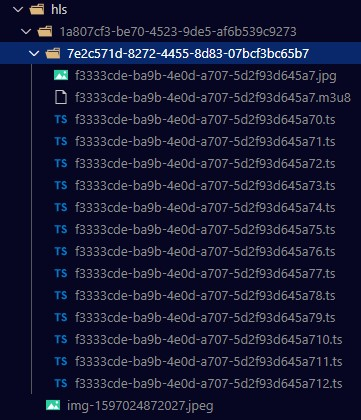</img>  

* * *
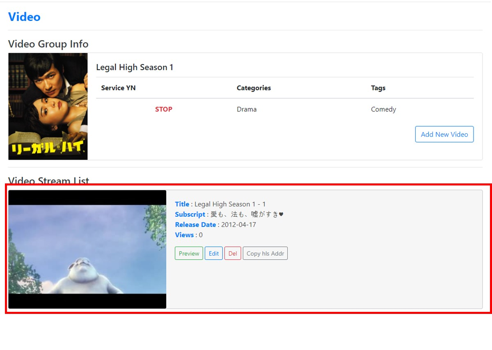</img> 
If converting is completed successfully, the list is updated. 
Thumbnails automatically select and save frames corresponding to 10 seconds from the video.  
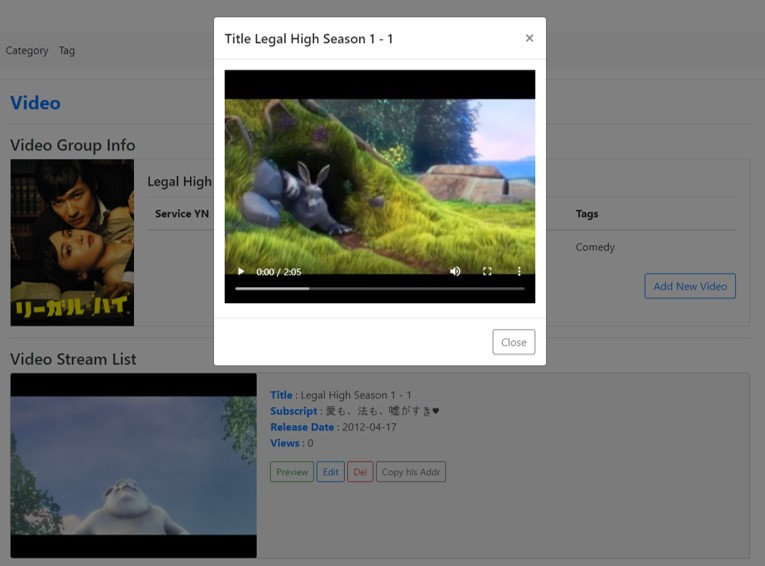</img> 
Click the Preview button to check the converted video.  
If you click the Copy hls Addr button, you can copy the stream url that you can check on the client side. 
(If you change localhost to ip address in the copied address, you can check it in the external environment.)
  
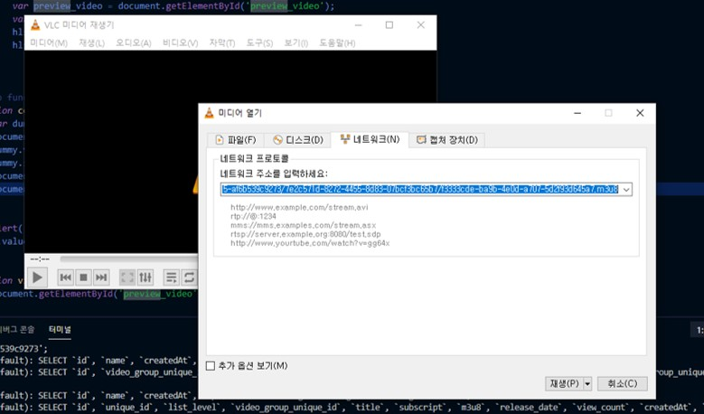</img> 
Paste the copied address to a player that can play m3u8, such as vlc player.  
</img> 
You can check that the streaming video plays normally.
